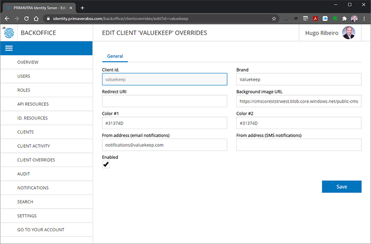

# Reference - Client Overrides

Although Identity Server can be used by itself - to manage it using the back-office for example - usually it is used in the context of a client application, which triggers its features, like, for example, the UI to sign-in the user.

Most of the time IDS is used as part of a more complex workflow of the client application.

That is why IDS provides the ability to customize the following features according to the client application active at any given moment.

- The brand name
- The background image
- The main colors of the sign-in & registration experience
- The email address used to send notifications to the users
- The alias used to send SMS notifications to the users
- A redirect URI to redirect users to the client applications after certain operations (for example, after confirming his email address)

These settings can be customized independently - it is possible to set any number of the settings - in the back-office by creating overrides for each specific client application.

This feature is available in the back-office - for managers and contributes, through the CLIENT OVERRIDES menu option.

Its is only required to create a new record with the adequate client identifier and then set one or more of the settings.

After being set, these settings override the default values used by IDS for any operation performed under the context of the client application (or triggered by it).

> Be aware that IDS applies caching on client overrides. It may take a few minutes for new settings to be effectively applied. 

The following table describes how each of the settings customize IDS:

| Setting | Description | Use Cases |
| - | - | - |
| Brand | Replaces the default brand name (Identity Server) | Heading  and subject of email and SMS notifications |
| Background image | Replaces the background image in the sign-in experience | Sign-in, registration, email confirmation, etc. |
| From Address (email notification) | Replaces `no-reply@primaverabss.com` on email notifications | Email notifications |
| From Address (SMS notifications) | Replaces PRIMAVERA on SMS notifications | SMS notifications |
| Color #1 | Replaces the main color in sign-in experience | Color used for buttons and main titles |
| Color #2 | Replaces the secondary color | Highlight color used for buttons |