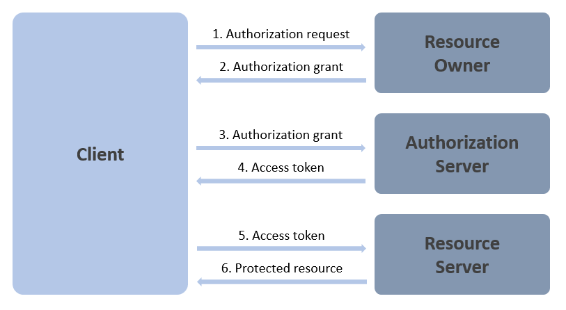

# Reference - OAuth

OAuth 2.0 is a protocol for authorization which focuses on simplicity while providing specific authorization flows for Web applications, desktop applications, mobile phones, and devices.

For the complete specification see [RFC 6749](https://tools.ietf.org/html/rfc6749) and others.

## Terminology

OAuth specifies 4 roles:

- **Resource Owner**: an entity capable of granting access to a protected resource. If this entity is a person, it is often referred to as an **user** (or **end-user**).

- **Resource Server**: the server hosting the protected resources, capable of responding to requests for protected resources using tokens.

- **Client**: an **application** performing protected resources requests **on behalf of the resource owner** and **with its authorization**.

- **Authorization Server**: the server issuing access tokens to clients after authenticating the resource owner and obtaining authorization. It may be the same server as the resource server or not. It may issue access tokens accepted by multiple resource servers.

## General Protocol Flow

The generic flow of the OAuth protocol is depicted in the following diagram:

1. The client requests authorization from the resource owner. This request can be performed directly to the resource owner (as depicted) or indirectly via the authorization server (preferrable).

2. The client receives an authorization grant, a credential representing the resource owner's authorization. This grant type depends on the method used by the client to request authorization and the grant types supported by the authorization server.

3. The client requests an access token from the authorization server by authenticating and presenting the authorization grant obtained previously.

4. The authorization server issues the access token, after authenticating the client and validating the authorization grant.

5. The client requests the protected resource from the resource server by presenting the access token.

6. The resource server responds to the request, after validating the access token.

## Scopes

Scopes are the mechanism used in OAuth to describe and limit the access granted to an application to protected resources.

Access tokens always include the authorized scopes and that is how the resource server is able to validate access tokens and decide on whether to accept requests from clients.

When applicable, these scopes are presented to the end-user in the consent screen, where he grants/refuses/revokes authorization.

Scopes may be required, meaning that the client application can only operate correctly if those are granted, or optional, in the sense that the client application may still be able to perform part of its function without them.

Here are some examples:

- `email` - grants access to the end-user's email address.
- `photo` - grants access to the end-user's picture.
- `invoicing-api` - grants access to an API that allows creating invoices on behalf of the user.

## Client Types

The specification identifies 2 kinds of clients, depending on their ability to maintain the confidentiality of their credentials:

- **Confidential**: clients that are capable of maintaining confidentiality of their credentials. These are typically implemented on secure servers with restricted access to the client credentials (e.g. Web servers).

- **Public**: clients incapable of protecting the client credentials, like clients running on the resource owner's devices or browser-based applications.

## Authorization Grants

An authorization grant (or authorization flow or grant type) defines a credential that represents the authorization given by the resource owner to the client, that it may be use to obtain access tokens.

OAuth defines 4 grant types (**Authorization Code**, **Client Credentials**, **Implicit**, and **Resource Owner Password**) and an extensibility mechanism that allows defining additional grant types (extension grants).

> Implicit and Resource Owner Password are deprecated and not recommended (although still supported).

### Authorization Code

Instead of requesting authorization directly from the resource owner, the client directs the user (resource owner) to the authorization server (via the browser), which in turn redirects him back to the client with an authorization code.

Before redirecting the user back to the client, the authorization server authenticates him and obtains authorization from him.

> Since the user only authenticates with the authorization server, his credentials are never shared with the client.

This flow offers important security benefits:

- The ability to authenticate the client.
- The access token is transmitted directly from the authority server to the client without passing it through the user's browser (user agent), which could potentially exposit it to others (including the user).

### Authorization Code with PKCE

[PKCE](https://tools.ietf.org/html/rfc7636) (Proof Key for Code Exchange) is an extension to the Authorization Code grant that augments security on public clients to mitigate authorization code interception.

> Although it was designed originally for mobile applications, it is recommended for any public client, including Web applications using client secrets.

The main differences to authorization code are the following:

- When the client initiates the authorization request, instead of immediately launching a browser, it first creates a "code verifier" (a random string between 43 and 128 characters long). It then uses that code to create a "code challenge" (an hash calculated on the code verifier) and includes it in the authorization request.
- The authorization server will recognize this code challenge and associate it with the authorization code that it issues (and store it somehow). It then returns the authorization code as normal (without the code challenge).
- When the client exchanges the authorization code for the access token, it is required to send the original code verifier as a parameter.
- The authorization server will then be able to validate the code verifier against the code challenge received previously (along with all the other parameters validated in the Authorization Code flow) and only issue the access token if there is a match.

> Notice that PKCE does not add any new requests to the Authorization Code flow, only additional parameters. Nevertheless it mitigates interception attacks by validation the additional code verifier parameter.

### Implicit

This grant type is a simplified version of the authorization code flow, optimized for clients implemented in a browser.

Instead of issuing an authorization code, the authorization server issues the access token directly as the result of authorization, and it does not authenticate the client (although its identity may be verified indirectly via the redirect URI used to deliver the access token).

> This authorization grant has been [recommended for deprecation](https://tools.ietf.org/html/draft-ietf-oauth-security-topics-09). Authorization Code should used instead.

### Client Credentials

Client credentials are used when the client is acting on its own behalf, and/or in machine-to-machine scenarios with no end-users involved.

This is the case when the client is also the resource owner or when the client is requesting access to resources based on some authorization previously arranged (granted) with the authorization server.

> This arrangement can simply be set in the client configuration on the authorization server (see allowed scopes).

The client simply requests an access token for a given set of scopes from the authorization server, and uses it to perform the requests to the resource server. The authorization server uses the client credentials (present in the request) to authenticate the client.

> This grant flow is suited for confidential clients, not for public clients.

### Resource Owner Password

This grant type uses the resource owner password credentials (the user name and password) to obtain the access token.

As such, it should only be used when there is a high level of trust between the client and the resource owner (e.g. when the client is a high-proviledged application, like one that is part of the resource server implementation).

> This authorization grant has been recommended for deprecation. It should NOT be used as it exposes the resource owner password.

### How to Choose the Addequate Authorization Grant 

| Grant Type | Recommendations |
| - | - |
| Authorization Code | Public applications Browser-based applications User-facing applications |
| Authorization Code with PKCE | Prefer over Authorization Code when possible |
| Client Credentials | Confidential applications Machine to machine |
| Implicit | Not recommended Prefer Authorization Code or Hybrid (see OIDC) |
| Resource Owner Password | Not recommended |

## References

- [https://tools.ietf.org/html/rfc6749](https://tools.ietf.org/html/rfc6749)
- [https://tools.ietf.org/html/rfc7636](https://tools.ietf.org/html/rfc7636)
- [https://oauth.net/2](https://oauth.net/2)
- [https://www.oauth.com](https://www.oauth.com)