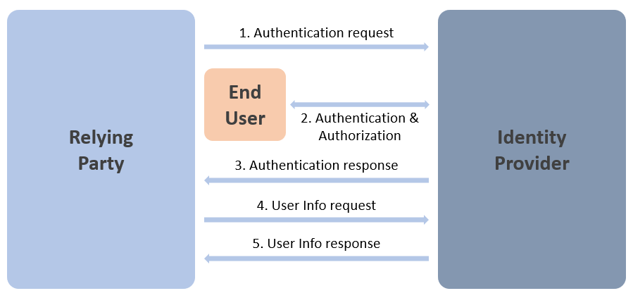

# Reference - OIDC

OpenID Connect (OIDC) 1.0 is an identity layer built on top of OAuth 2.0 to allow client applications to verify the identity of the end-user in the authentication process performed by the authorization server, as well to obtain profile information about the end-user.

## Terminology

- **Identity Provider (IDP)**: an entity that offers user authentication as a service.

- **Relying Party (RP)**: an entity that outsources user authentication to an IDP.

## General Protocol Flow

The abstract flow of the OIDC protocol is the following:



1. The client application (RP) sends a request to perform authentication to the IDP.

2. The IDP authenticates the end-user and obtains his authorization.

3. The IDP responds to the RP with an identity token and, usually, an access token.

4. The RP makes a request to the IDP User Info endpoint, using the access token received, to obtain information about the end-user.

5. The User Info endpoint returns the claims for the end-user.

## ID Token

The ID token (or identity token) is the first extension made by OIDC on OAuth 2.0.

This security token - typically a JWT (Json Web Token) contains information (claims) about the authentication of a specific end-user by an authorization server when using a specific client. It may also contain additional claims.

Here's an example:

```json
{
   "iss": "https://server.example.com",
   "sub": "24400320",
   "aud": "s6BhdRkqt3",
   "nonce": "n-0S6_WzA2Mj",
   "exp": 1311281970,
   "iat": 1311280970,
   "auth_time": 1311280969,
   "acr": "urn:mace:incommon:iap:silver"
}
```

## Claims

A claim is a piece of information about an entity (which can the end-user, the client application, etc.). Each claim is defined by a claim type and a value.

The specification defines a set of standard claims (e.g. `sub`, `name`, `profile`, `picture`, `email`, etc.) and supports additional (custom) claims, agreed somehow between the IDP and the RP.

> Identity Server supports custom claims by allowing them to be defined for users, for clients, and for API resources and API scopes and it provides configuration options (for the clients) to specify how these are included or not in tokens.

## Authentication and Authorization Grants

OIDC is responsible for signing-in the end-user or to determine if the user is already signed-in. The result is represented by an ID token.

There are 3 authorization grants that can be used to perform authentication:

| Authorization Grant | Response Type |
| - | - |
| Authorization code | `code` |
| Implicit | `id_token` or `id_token token` |
| Hybrid |` code id_token` or `code token` or `code id_token token` |

The authorization grant used determines how the access token and the ID token are communicated to the client.

| Property | Authorization Code Flow | Implicit Flow | Hybrid Flow |
| - | - | - | - |
| All tokens returned from Authorization Endpoint | No | Yes | No |
| All tokens returned from Token Endpoint | Yes | No | No |
| Tokens not revealed to User Agent | Yes | No | No |
| Client can be authenticated | Yes | No | Yes |
| Refresh Token possible | Yes | No | Yes |
| Communication in one round trip | No | Yes | No |
| Most communication server-to-server | Yes | No | Varies |

> Notice the effects of each grant in terms of client/server communication and security.

### Authorization Code

Authentication with the Authorization Code grant follows these steps:

1. Client prepares an authentication request containing the desired request parameters.
2. Client sends the request to the authorization server.
3. Authorization Server authenticates the end-user.
4. Authorization Server obtains end-user consent (if required).
5. Authorization Server sends the end-user back to the client with an authorization Code.
6. Client requests a response using the previously obtained authorization code at the Token endpoint.
7. Client receives a response that contains an ID token and an access token in the response body.
8. Client validates the ID token and retrieves the end-user's subject identifier.

### Implicit

Authentication with the Implicit grant follows these steps:

1. Client prepares an authentication request containing the desired request parameters.
2. Client sends the request to the authorization server.
3. Authorization Server authenticates the end-user.
4. Authorization Server obtains end-user consent (if required).
5. Authorization Server sends the end-user back to the client with an ID token and, if requested, an access token.
6. Client validates the ID token and retrieves the end-user's subject identifier.

> This authorization grant has been [recommended for deprecation](https://tools.ietf.org/html/draft-ietf-oauth-security-topics-09).

### Hybrid

Authentication with the Hybrid grant follows these steps:

1. Client prepares an authentication request containing the desired request parameters.
2. Client sends the request to the authorization server.
3. Authorization Server authenticates the end-user.
4. Authorization Server obtains end-user consent (if required).
5. Authorization Server sends the end-user back to the client with an authorization code and, depending on the response type, one or more additional parameters.
6. Client requests a response using the authorization code received previously at the Token endpoint.
7. Client receives a response that contains an ID Token and an access token in the response body.
8. Client validates the ID Token and retrieves the end-user's subject identifier.

### How to Choose the Addequate Authorization Grant 

| Grant Type | Recommendations |
| - | - |
| Authorization Code | Public applications<br/>Browser-based applications<br />User-facing applications |
| Authorization Code with PKCE | Prefer over Authorization Code when possible |
| Implicit | Not recommended<br/>Prefer Authorization Code or Hybrid |
| Hybrid | Public applications<br/>Browser-based applications<br />User-facing applications |

> Authorization Code or Hybrid differ basically in terms of the protection of the tokens from the browser and the amount of communication required to complete authentication (see above).

## References

- [https://openid.net/specs/openid-connect-core-1_0.html](https://openid.net/specs/openid-connect-core-1_0.html)
- [https://openid.net](https://openid.net)
- [https://openid.net/connect](https://openid.net/connect)
- [https://developer.okta.com/blog/2019/10/21/illustrated-guide-to-oauth-and-oidc](https://developer.okta.com/blog/2019/10/21/illustrated-guide-to-oauth-and-oidc)
