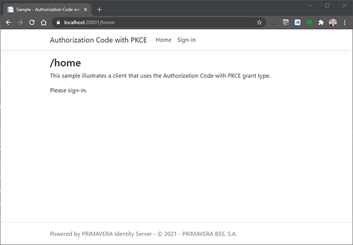
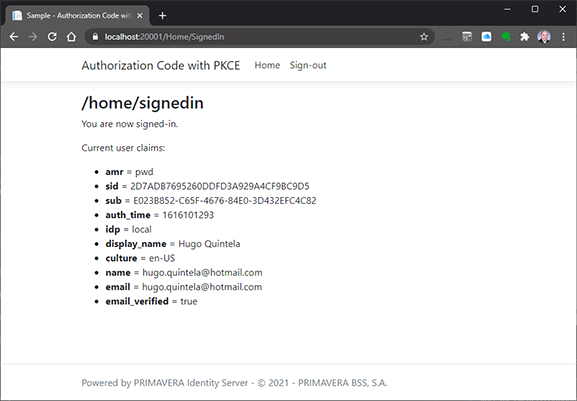

# Sample - Authorization Code with PKCE Client

This sample shows how to create a client application that uses the Authorization Code with PKCE flow to authenticate users.

The projects required for this sample are:

- `AuthorizationCodeWithPkceClient.csproj`

## Concept

The authorization code grant type allows client applications to authenticate end-users and invoke API operations using the tokens issued by Identity Server.

PKCE (Proof Key for Code Exchange) adds an extra layer of security that prevents interception of the authorization code.

## Resources Configuration

This sample requires the following resources to be configured in the back-office:

> Use `AuthorizationCodeWithPkceClient.authzspec.json` to import these resources in the back-office.

### Clients

| Configuration | Value |
| - | - |
| Client Id. | `sample-authorizationcode-pkce` |
| Require client secret | `false` |
| Require consent | `false` |
| Allow access tokens via browser | `false` |
| Require PKCE | `true` |
| Allowed Grant types | `authorization_code` |
| Allowed Scopes | `openid email profile` |
| Redirect URIs | `https://localhost:[PORT]/signin-oidc` |
| Post-logout redirect URIs | `https://localhost:[PORT]/signout-callback-oidc` |

## Behavior

When the application is executed it will open a browser and show the home page.

This page does not require authentication:



Notice the "Sign-in" menu. This is how authorization and user authentication happens:

1. The user is redirected to the IDS sign-in screen.

2. After he signs-in, he is redirected back to the application:

> Since the client is configured to not require consent, the consent dialog is not presented to the user.



> The page lists the user claims, which are derived directly from the identity token issued by IDS.

## Worth Noting

The actual implementation if very straightforward.

### Authorization and Authentication

Authorization and authentication are setup in `Startup.cs`:

```csharp
public void ConfigureServices(IServiceCollection services)
{
    (...)

    JwtSecurityTokenHandler.DefaultInboundClaimTypeMap.Clear();

    services
        .AddAuthorization();

    services
        .AddAuthentication(
            (options) =>
            {
                options.DefaultScheme = "Cookies";
                options.DefaultChallengeScheme = "oidc";
            })
        .AddCookie(
            (options) =>
            {
                options.AccessDeniedPath = new PathString("/home/accessdenied");
            })
        .AddOpenIdConnect(
            "oidc",
            (options) =>
            {
                options.SignInScheme = "Cookies";
                options.Authority = this.Configuration
                    .GetValue<string>("SAMPLE_AUTHORITYSERVER_BASEADDRESS");
                options.RequireHttpsMetadata = false;
                options.ClientId = "sample-authorizationcode-pkce";
                options.ResponseType = "code";
                options.UsePkce = true;
                options.SaveTokens = true;
                options.GetClaimsFromUserInfoEndpoint = false;

                options.Scope.Add("profile");
                options.Scope.Add("email");
                options.Scope.Add("identityserver4");

                options.Events = new OpenIdConnectEvents()
                {
                    OnAuthorizationCodeReceived = OnAuthorizationCodeReceivedAsync,
                    OnTokenResponseReceived = OnTokenResponseReceivedAsync,
                    OnUserInformationReceived = OnUserInformationReceivedAsync
                };
            })
        .AddJwtBearer();
}
```

- `AddAuthentication()`, `AddCookie()`, and `AddOpenIdConnect()` configure the whole authentication using OIDC.
- The `Authorization Code` grant flow is requested in `options.ResponseType` and the PKCE is activated with `options.UsePkce`.
- The client is set in `options.ClientId` and the scopes requested in `options.Scopes`.

```
public void Configure(IApplicationBuilder app, IWebHostEnvironment env)
{
    (...)

    app.UseAuthentication();

    app.UseAuthorization();

    (...)
}
```

> Keep in mind that the position of `UseAuthentication()` and `UseAuthorization()` relative to each other and relative to other middleware - `UseRouting()` and `UseEndpoints()` in particular - is relevant.

### Authorization Handler

The only thing left to configure is to add the `[Authorize]` attribute to the adequate controller actions to force user authentication:

```csharp
/// <summary>
/// Defines the home controller.
/// </summary>
/// <seealso cref="Controller" />
public partial class HomeController : Controller
{
    #region Public Methods

    /// <summary>
    /// Executes the index action.
    /// </summary>
    /// <returns>The action result.</returns>
    public IActionResult Index()
    {
        return this.View("Index");
    }

    /// <summary>
    /// Executes the signed-in action.
    /// </summary>
    /// <returns>The action result.</returns>
    [Authorize]
    public IActionResult SignedIn()
    {
        return this.View("SignedIn");
    }
    
    (...)
}
```

> Notice that `Index` (the home page) does not include the attribute, thus it does not require user authentication.