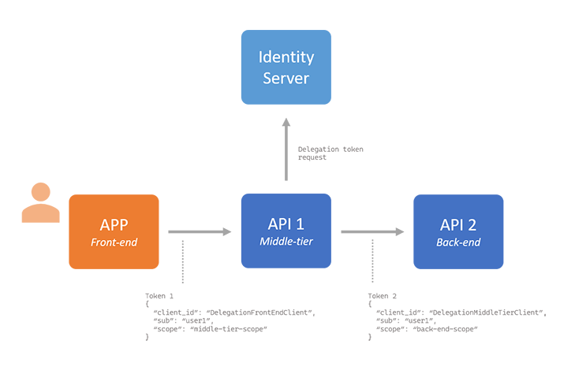
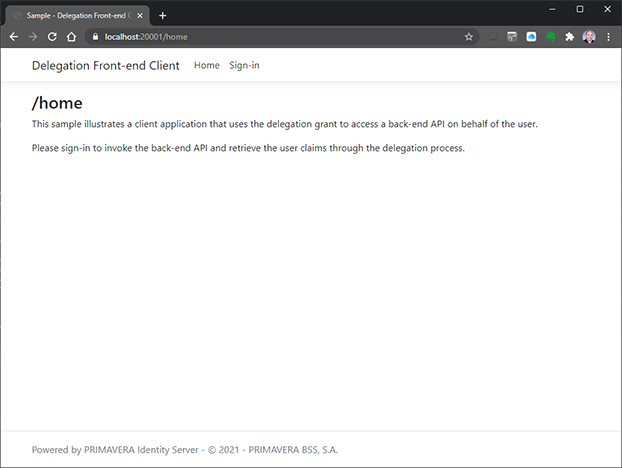

# Sample - Delegation Grant

This sample shows how to create a client application and a middle-tier API that use the Delegation flow to call a back-end API on behalf of an user.

The projects required for this sample are:

- `DelegationFrontEndClient.csproj`
- `DelegationMiddleTierApi.csproj`
- `DelegationBackEndApi.csproj`

## Concept

Imagine a scenario where a front-end application invokes a middle-tier API using a token acquired via an interactive flow (e.g. hybrid). This middle-tier API than needs to call a back-end API on behalf of the user.



> There is a concept called "poor man's delegation" where the token obtained in the front-end is simply forwarded to the back-end. The major shortcoming in that implementation is that the back-end API must also accept the scope for the middle-tier API and that would allow the user to simply invoke the back-end directly. Also, the implementation would not allow to augment the token with additional claims specific to the delegation going on.

The scenario described above can be implemented using the `Delegation` grant, which is supported by Identity Server:

- The front-end obtains a token using the hybrid grant (thus, the token has the user identity).
- It then sends that token to the middle-tier API.
- The middle-tier API then exchanges that token for a new one that allows it to invoke the back-end API. This new token maintains the user identity but has only the scopes required by the back-end API.

> The original token (from the front-end) cannot be used to invoke the back-end. The token exchange - an interaction with the authority server, performed in the middle-tier - can involve changes in the token claims (not only in the scopes).

> This sample uses an ASP.NET application as the front-end application. But it could be any kind of application using one of the interactive flows.

## Resources Configuration

This sample requires the following resources to be configured in the back-office:

> Use `DelegationGrant.authzspec.json` to import these resources in the back-office.

### API Scopes

| Configuration | Value |
| - | - |
| Scope  | `delegation-middle-tier-scope` |
| Display name | `Delegation Sample - Middle-tier API Scope` |

| Configuration | Value |
| - | - |
| Scope  | `delegation-back-end-scope` |
| Display name | `Delegation Sample - Back-end API Scope` |

### API Resources

| Configuration | Value |
| - | - |
| Name | `delegation-middle-tier-api` |
| Display name | `Delegation Sample - Middle-tier API` |
| Scopes | `delegation-middle-tier-scope` |

| Configuration | Value |
| - | - |
| Name | `delegation-back-end-api` |
| Display name | `Delegation Sample - Back-end API` |
| Scopes | `delegation-back-end-scope` |

### Clients

| Configuration | Value |
| - | - |
| Client Id. | `delegation-front-end-client` |
| Require client secret | `false` |
| Require consent | `true` |
| Allow remembering consent | `true` |
| Allow access tokens via browser | `true` |
| Require PKCE | `false` |
| Allowed Grant types | `hybrid` |
| Allowed scopes | `openid email profile middle-tier-scope` |
| Redirect URIs | `https://localhost:[PORT]/signin-oidc` |
| Post-logout redirect URIs | `https://localhost:[PORT]/signout-callback-oidc` |

| Configuration | Value |
| - | - |
| Client Id. | `delegation-middle-tier-client` |
| Require client secret | `true` |
| Client secret | `secret` |
| Require consent | `false` |
| Allowed Grant types | `delegation` |
| Allowed scopes | `delegation-back-end-scope` |

## Behavior

When the front-end application is executed it will open a browser in the home page, which does not require authentication:



When the user signs-in the authentication flow is initiated and after it is completed the browser navigates to a new route, authenticated, that outputs the result of the application:


What this output shows is the result of invoking the middle-tier API which in turn invokes the back-end API and the whole delegation process takes place.

To illustrate exactly that, the page outputs the tokens as they are set in each of the layers (the front-end, the middle-tier, and the back-end). It is clearly visible that the tokens are not always the same, and, more important, the user claims are different (representing the "user permissions" and what data each layer needs or as access from the user).

## Worth Noting

### Authentication and Authorization in the Front-end Application

The authentication and authorization middleware in the front-end application are setup like any other hybrid client (see sample).

The only thing worth noticing in particular is that this client only requests the scope required by the middle-tier API, not the scope for the back-end API.

```csharp
services
    .AddAuthentication(
        (options) =>
        {
            options.DefaultScheme = "Cookies";
            options.DefaultChallengeScheme = "oidc";
        })
    .AddCookie(
        (options) =>
        {
            options.AccessDeniedPath = new PathString("/home/accessdenied");

            options.Events = new CookieAuthenticationEvents()
            {
                OnValidatePrincipal = OnCookieValidatePrincipalAsync
            };
        })
    .AddOpenIdConnect(
        "oidc",
        (options) =>
        {
            options.SignInScheme = "Cookies";
            options.Authority = this.Configuration.GetValue<string>("SAMPLE_AUTHORITYSERVER_BASEADDRESS");
            options.RequireHttpsMetadata = false;
            options.ClientId = "delegation-front-end-client";
            options.ResponseType = "code id_token token";
            options.SaveTokens = true;
            options.GetClaimsFromUserInfoEndpoint = true;

            options.Scope.Add("profile");
            options.Scope.Add("email");
            options.Scope.Add("delegation-middle-tier-scope");

            options.Events = new OpenIdConnectEvents()
            {
                OnAuthorizationCodeReceived = OnAuthorizationCodeReceivedAsync,
                OnTokenResponseReceived = OnTokenResponseReceivedAsync,
                OnUserInformationReceived = OnUserInformationReceivedAsync
            };
        })
    .AddJwtBearer();
```

### Authentication and Authorization in the Middle-tier API

The middle-tier API is a simple Web application that contains the API only and does not require OIDC.

Authorization is setup using policies in `ConfigureServices()`:

```csharp
services.AddAuthorization(
    options =>
    {
        options.AddPolicy(
            "middle-tier-policy",
            policy =>
            {
                policy.AuthenticationSchemes = new List<string>()
                {
                    "Bearer"
                };

                policy.RequireClaim("scope", "delegation-middle-tier-scope");
            });
    });
```

By doing so, the controller actions that require authorization need to have the `Authorize` attribute with reference to the authorization policy:

```csharp
[ActionName("Principal.Claims")]
[HttpGet("/principal/claims")]
[Authorize("middle-tier-policy")]
public async Task<IActionResult> GetPrincipalClaimsAsync()
{
}
```

Authentication uses JWT bearer, as expected:

```csharp
services
    .AddAuthentication("Bearer")
    .AddJwtBearer(
        (options) =>
        {
            options.Authority = this.Configuration.GetValue<string>("SAMPLE_AUTHORITYSERVER_BASEADDRESS");
            options.Audience = "delegation-middle-tier-api";
            options.RequireHttpsMetadata = false;
            options.IncludeErrorDetails = true;
            options.RefreshOnIssuerKeyNotFound = true;
            options.SaveToken = true;

            options.TokenValidationParameters = new TokenValidationParameters
            {
                NameClaimType = "name",
                RoleClaimType = "role"
            };

            options.Events = new HttpBearerChallengeEvents()
            {
                OnAuthenticationFailed = OnJwtBearerAuthenticationFailedAsync,
                OnForbidden = OnJwtBearerForbiddenAsync,
                OnMessageReceived = OnJwtBearerMessageReceivedAsync,
                OnTokenValidated = OnJwtBearerTokenValidatedAsync,
                OnChallenge = OnJwtBearerChallengeAsync
            };
        });
```

> Notice how the API resource is configured in `options.Audience`.

### Authentication and Authorization in the Back-end API

The back-end API is configure the same way as the middle-tier API.

```csharp
services.AddAuthorization(
    options =>
    {
        options.AddPolicy(
            "back-end-policy",
            policy =>
            {
                policy.AuthenticationSchemes = new List<string>()
                {
                    "Bearer"
                };

                policy.RequireClaim("scope", "delegation-back-end-scope");
            });
    });

services
    .AddAuthentication("Bearer")
    .AddJwtBearer(
        (options) =>
        {
            options.Authority = this.Configuration.GetValue<string>("SAMPLE_AUTHORITYSERVER_BASEADDRESS");
            options.Audience = "delegation-back-end-api";
            options.RequireHttpsMetadata = false;
            options.IncludeErrorDetails = true;
            options.RefreshOnIssuerKeyNotFound = true;
            options.SaveToken = true;

            options.TokenValidationParameters = new TokenValidationParameters
            {
                NameClaimType = "name",
                RoleClaimType = "role"
            };

            options.Events = new HttpBearerChallengeEvents()
            {
                OnAuthenticationFailed = OnJwtBearerAuthenticationFailedAsync,
                OnForbidden = OnJwtBearerForbiddenAsync,
                OnMessageReceived = OnJwtBearerMessageReceivedAsync,
                OnTokenValidated = OnJwtBearerTokenValidatedAsync,
                OnChallenge = OnJwtBearerChallengeAsync
            };
        });
```

### How the Front-end Calls the Middle-tier

After authentication occurs, the front-end comes to possession of an access token and an identity token associated with the signed-in user.

The are available as raw through an event associated with the authentication middleware:

`Startup.cs`:

```csharp
public void ConfigureServices(IServiceCollection services)
{
    (...)

    .AddCookie(
        (options) =>
        {
            options.AccessDeniedPath = new PathString("/home/accessdenied");

            options.Events = new CookieAuthenticationEvents()
            {
                OnValidatePrincipal = OnCookieValidatePrincipalAsync
            };
        })

    (...)
}

private static Task OnCookieValidatePrincipalAsync(CookieValidatePrincipalContext context)
{
    SmartGuard.NotNull(() => context, context);

    // Collect the tokens when their are received and store them as claims so they can be used in the controller

    IEnumerable<AuthenticationToken> tokens = context.Properties.GetTokens();

    if (context.Principal?.Identity != null)
    {
        ClaimsIdentity identity = context.Principal.Identity as ClaimsIdentity;
        if (identity != null)
        {
            AuthenticationToken accessToken = tokens.FirstOrDefault(t => t.Name.EqualsNoCase("access_token"));
            AuthenticationToken identityToken = tokens.FirstOrDefault(t => t.Name.EqualsNoCase("id_token"));

            if (accessToken != null)
            {
                identity.AddClaim(new Claim("x-front-end-access-token", accessToken.Value));
            }

            if (identityToken != null)
            {
                identity.AddClaim(new Claim("x-front-end-id-token", identityToken.Value));
            }
        }
    }

    // Result

    return Task.CompletedTask;
}
```

> The tokens are being added to the user claims as a convenient way to have them available in the controller that invokes the middle-tier API. There are different ways to store these tokens or retrieve them in the controller.

Next, the `HomeController` simply invokes the middle-tier API an composes the result to show in a view:

```csharp
public async Task<IActionResult> SignedInAsync()
{
    // The user is authenticated here

    FrontClientResponseData model = new FrontClientResponseData()
    {
        Claims = new List<ClaimData>()
    };

    // Collect the user claims in the front-end application

    foreach (Claim claim in this.User.Claims.OrderBy(i => i.Type))
    {
        if (!claim.Type.StartsWithNoCase("x-front-end"))
        {
            model.Claims.Add(
                new ClaimData(claim));
        }
    }

    // Collect the tokens from the special (injected) claims

    model.AccessToken = this.User.Claims.FirstOrDefault(i => i.Type.EqualsNoCase("x-front-end-access-token"))?.Value;
    model.IdentityToken = this.User.Claims.FirstOrDefault(i => i.Type.EqualsNoCase("x-front-end-id-token"))?.Value;

    // Invoke the middle-tier API using the access token

    MiddleTierResponseData response = await this.InvokeMiddleTierApiAsync(
        model.AccessToken)
        .ConfigureAwait(false);

    model.MiddleTierResponse = response;

    // Show the view

    return this.View("SignedIn", model);
}
```

> The request itself is straightforward and just uses `HttpClient` (see `InvokeMiddleTierApiAsync()`).

### How the Middle-tier Calls the Back-end (Delegation)

When the `PrincipalController` in the middle-tier API receives the request it performs 3 steps to compose its response:

1. It collects the user claims and the access token received in the request.
2. Performs the delegation, exchanging that access token for a new one, obtained from Identity Server.
3. Invokes the back-end API with this new token.

All that is implemented in `GetPrincipalClaimsAsync()`. Notice in particular how delegation happens:

```csharp
private async Task<(string, string)> ExchangeAccessTokenAsync(string accessToken)
{
    using TokenClient tokenClient = new TokenClient();

    TokenRequest tokenRequest = new TokenRequest()
    {
        Address = this.Configuration.GetValue<string>("SAMPLE_AUTHORITYSERVER_BASEADDRESS"),
        GrantType = "delegation",
        ClientId = "delegation-middle-tier-client",
        ClientSecret = "secret",
        Parameters = new Dictionary<string, string>()
        {
            ["scope"] = "delegation-back-end-scope",
            ["token"] = accessToken,
        }
    };

    TokenResponse tokenResponse = await tokenClient.GetTokenAsync(tokenRequest).ConfigureAwait(false);
    if (tokenResponse.IsError)
    {
        return (null, tokenResponse.Error);
    }

    return (tokenResponse.AccessToken, null);
}
```

This is a just a token request to IDS, using the `TokenClient` available in Hydrogen. The magic happens in the grant type requested (`delegation`) and in the `token` parameter where the original token is sent.

### How the Back-end Responds

The response from the back-end API is a simple API response, building the result, again, from the user claims and the access token (just to be able to show in the front-end application).

See `PrincipalController.GetPrincipalClaims()`.

### Results in the Front-end

The results received from the middle-tier contain the data composed from the middle-tier and the back-end API. These are just sent to the view `SignedIn.cshtml` for presentation.

That's it.