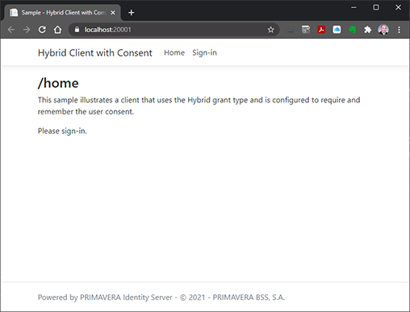
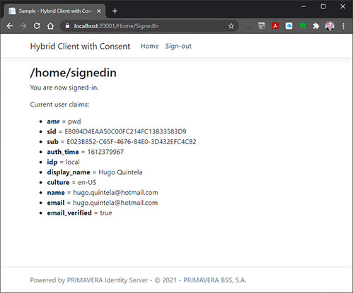

# Sample - Hybrid Client with Consent

This sample shows how to create a client application that uses the Hybrid flow to authenticate users and request them consents.

> The source code is available in the Identity Server samples folder.

## Concept

The hybrid grant type allows client applications to authenticate users with Identity Server and perform API calls using the identity token issued for the authenticated user.

You can associate an extra requirement to present the user with a consent, to inform him of the "permissions" he will be granting the application and allow him to accept or deny it.

> After the user grants the consent, he will always have the possibility to revoke it from the account front-office (under Security/Consents). Once the consent is revoked, the application will no longer be able to perform requests on behalf of the user and will be required to repeat the authorization flow.

## Client Configuration

This samples requires the configuration of a new client - called `identityserver-sample-hybridclientwithconsent` - in the IDS back-office. This client should be created with the following configuration options:

| Configuration | Value |
| - | - |
| Require client secret | `false` |
| Require consent | `true` |
| Allow remembering consent | `true` |
| Allow access tokens via browser | `true` |
| Require PKCE | `false` |
| Grant types | `Hybrid` |
| Scopes | `openid email profile identityserver4` |
| Redirect URIs | `https://localhost:[PORT]/signin-oidc` |
| Post-logout redirect URIs | `https://localhost:[PORT]/signout-callback-oidc` |

## Behavior

When the application is executed it will open a browser and show the home page.

This page does not require authentication:



Notice the "Sign-in" menu. This is how authorization and user authentication happens:

1. The user is redirected to the IDS sign-in screen.

2. After he signs-in, the consent is presented to the user so he can accept it:


> Notice that "Personal Information" and "Application access" list the scopes requested (see the client configuration and the noted below).

3. After the user accepts the consent, he is redirected back to the application to a page (route):



> The page lists the user claims, which are derived directly from the identity token issued by IDS.

## Worth Noting

The actual implementation if very straightforward.

### Authorization and Authentication Configuration

Authorization and authentication are setup in `Startup.cs`:

```csharp
public void ConfigureServices(IServiceCollection services)
{
    (...)

    JwtSecurityTokenHandler.DefaultInboundClaimTypeMap.Clear();

    services
        .AddAuthorization();

    services
        .AddAuthentication(
            (options) =>
            {
                options.DefaultScheme = "Cookies";
                options.DefaultChallengeScheme = "oidc";
            })
        .AddCookie(
            (options) =>
            {
                options.AccessDeniedPath = new PathString("/home/accessdenied");
            })
        .AddOpenIdConnect(
            "oidc",
            (options) =>
            {
                options.SignInScheme = "Cookies";
                options.Authority = "https://localhost:5001";
                options.RequireHttpsMetadata = false;
                options.ClientId = "identityserver-sample-hybridclientwithconsent";
                options.ResponseType = "code id_token token";
                options.SaveTokens = true;
                options.GetClaimsFromUserInfoEndpoint = true;

                options.Scope.Add("profile");
                options.Scope.Add("email");
                options.Scope.Add("identityserver4");

                options.Events = new OpenIdConnectEvents()
                {
                    OnAuthorizationCodeReceived = OnAuthorizationCodeReceivedAsync,
                    OnTokenResponseReceived = OnTokenResponseReceivedAsync,
                    OnUserInformationReceived = OnUserInformationReceivedAsync
                };
            })
        .AddJwtBearer();
}
```

- `AddAuthentication()`, `AddCookie()`, and `AddOpenIdConnect()` configure the whole authentication using OIDC.
- How the Hybrid grant flow is requested (in `options.ResponseType`).
- How the client is set (`options.ClientId`) and scopes are requested (`options.Scopes`) 

> When executing the sample, do not forget to update the Identity Server base address (in `options.Authority`).

```
public void Configure(IApplicationBuilder app, IWebHostEnvironment env)
{
    (...)

    app.UseAuthentication();

    app.UseAuthorization();

    (...)
}
```

> Keep in mind that the position of `UseAuthentication()` and `UseAuthorization()` relative to each other and relative to other middleware - `UseRouting()` and `UseEndpoints()` in particular - is relevant.

### Authorization Handler

The only thing left to configure is to add the `[Authorize]` attribute to the adequate controller actions to force user authentication:

```csharp
/// <summary>
/// Defines the home controller.
/// </summary>
/// <seealso cref="Controller" />
public partial class HomeController : Controller
{
    #region Public Methods

    /// <summary>
    /// Executes the index action.
    /// </summary>
    /// <returns>The action result.</returns>
    public IActionResult Index()
    {
        return this.View("Index");
    }

    /// <summary>
    /// Executes the signed-in action.
    /// </summary>
    /// <returns>The action result.</returns>
    [Authorize]
    public IActionResult SignedIn()
    {
        return this.View("SignedIn");
    }
    
    (...)
}
```

> Notice that `Index` (the home page) does not include the attribute, thus it does not require user authentication.