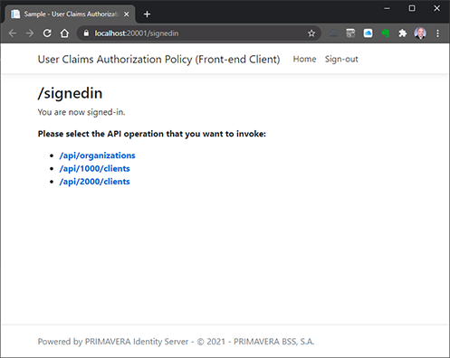
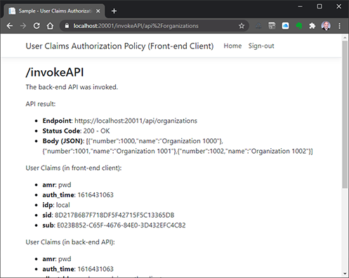
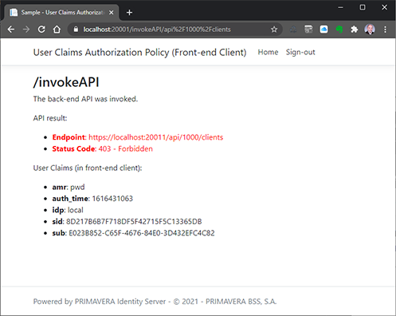
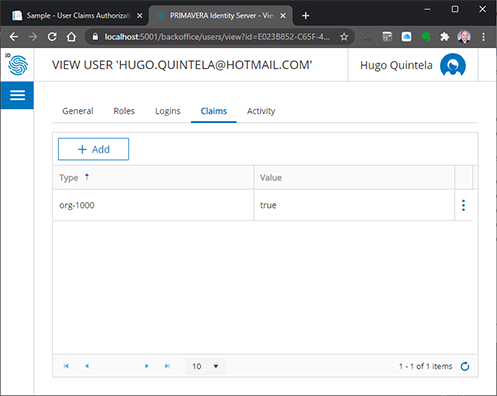
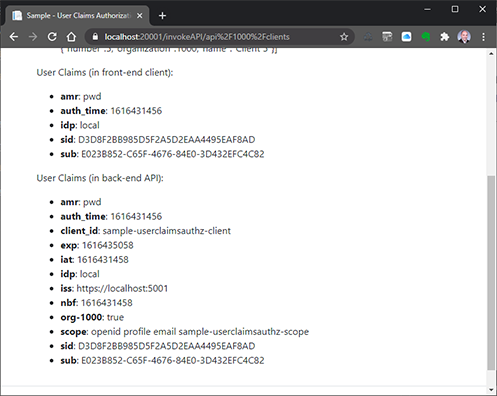

# Sample - User Claims Authorization Policy

This sample shows how to configure a back-end API to implement custom authorization on specific endpoints using authorization policies and the end-user's claims.

The projects required for this sample are:

- `UserClaimsAuthzPolicyBackEndApi.csproj`
- `UserClaimsAuthzPolicyFrontEndClient.csproj`

## Concept

Although OAuth is designed for authorization, its capabilities are limited to scopes and designed for authorizing client applications (not end-users) (and only to some extent).

It is usual for a multi-tenant API to have endpoints that include variables (in the route, for example) that determine which tenant is being accessed:

```
GET /api/{tenant}/clients
```

You could - in theory - bend the OAuth scope concept and define one or more scopes per tentant:

```
api-clients-tenant1
api-clients-tenant2
(...)
```

This approach, apart from being very combersome, has a major drawback: everytime a new tenant is created, the API scopes (and API resources) defined in the authorization server would need to be modified, which could lead to all kinds of problems in terms of backward-compatibility (of tokens, for example).

The general rule for OAuth is that anything that goes beyond scopes, is custom authorization, dependent on the specific scenario, specific resources and specific applications at play. OAuth provides mechanisms that can be leveraged to implement such custom authorization, but it is up to the applications to use them to implement the custom authorization logic required for each specific scenario. 

One of these mechanisms, often used to implement custom authorization, are user claims (or client claims for that matter).

Going back to the example above, you could validate that any given end-user (or client application on behalf of the end-user) can access a multi-tenant endpoint for a specific tenant only if the end-user has a specific user claim set.

For example, to access the endpoint `/api/1000/clients` (tenant is 1000), the user is required to have the claim `tenant-1000`. If not, access would be rejected.

This is relatively easy to implement with Identity Server, as demonstrated below.

## Resources Configuration

This sample requires the following resources to be configured in the back-office:

> Use `UserClaimsAuthzPolicy.authzspec.json` to import these resources in the back-office.

### API Scopes

| Configuration | Value |
| - | - |
| Scope  | `sample-userclaimsauthz-scope` |
| User Claims | `org-1000` `org-2000` `org-3000` `org-4000` |

### Clients

 Configuration | Value |
| - | - |
| Client Id. | `sample-userclaimsauthz-client` |
| Allowed Grant types | `authorization_code` |
| Allowed Scopes | `openid email profile sample-userclaimsauthz-scope` |
| Post-logout redirect URIs | `https://localhost:[PORT]/signout-callback-oidc` |
| Redirect URIs | `https://localhost:[PORT]/signin-oidc` |
| Require client secret | `false` |
| Require consent | `true` |
| Require PKCE | `true` |

## Behavior

This sample demonstrates a simple front-end client (`UserClaimsAuthzPolicyFrontEndClient`), a Web application that uses the Authorization Code with PKCE grant type, that allows invoking a multi-tenant back-end API (`UserClaimsAuthzPolicyBackEndApi`).

The back-end API includes - for the purpose of the sample - two endpoints, one multi-tenant and one not:

- `/api/organizations` : retrieves all the organizations available.
- `/api/{organization}/clients`: retrieves all the clients available in a specific organization.

The first one is a simple endpoint, protected by the general scope (`sample-userclaimsauthz-scope`).

The second one is multi-tenant (multi-organization in the sample) and is protected by the scope and a user claim that should match the organization being accessed (when accessing, for example, organization 1000, a claim named `org-1000` must be present in the access token).

> This authorization based on the claim works if the caller is invoking the API on behalf of a user (which is the case of this sample) by mapping the end-user claims in the access token, but would also work if the caller uses the client credentials flow (in which case, the claim could be derived from the client claims instead of the user claims).

After the front-client client is executed and the user signs-in, the following page is presented:



Notice the links available to invoke the back-end API endpoints.

If the first one - `/api/organizations` - is invoked, a result like the following is returned by the back-end API:



If the second one - `/api/1000/clients` - is invoked, the result will be a `403 (Forbidden)`:



This happens because, by default, the signed-in user will not have the `org-1000` user claim set.

> The same is true for the third endpoint.

Now if you use IDS back-office to edit the signed-in user, you can add that claim in the claims tab:



> You need to have the Back-office Administrator role to be able to access this operation in the back-office.

After this, it the user signs-out in the front-end, signs-in again, and accesses the organization 1000 endpoint, the back-end API will return a valid response:



> Notice the value of `org-1000` in the User Claims list.

## Worth Noting

### Authentication and Authorization in the Front-end Client

There is nothing special about the front-end client.

It is configured to use OIDC and the Authorization Code with PKCE grant type. And requests the back-end API scope (`sample-userclaimsauthz-scope`):

```csharp
public void ConfigureServices(IServiceCollection services)
{
    services
        .AddHttpClient();

    services
        .AddControllersWithViews();

    JwtSecurityTokenHandler.DefaultInboundClaimTypeMap.Clear();

    services
        .AddAuthorization();

    services
        .AddAuthentication(
            (options) =>
            {
                options.DefaultScheme = "Cookies";
                options.DefaultChallengeScheme = "oidc";
            })
        .AddCookie(
            (options) =>
            {
                options.AccessDeniedPath = new PathString("/home/accessdenied");
            })
        .AddOpenIdConnect(
            "oidc",
            (options) =>
            {
                options.SignInScheme = "Cookies";
                options.Authority = this.Configuration.GetValue<string>("SAMPLE_AUTHORITYSERVER_BASEADDRESS");
                options.RequireHttpsMetadata = false;
                options.ClientId = "sample-userclaimsauthz-client";
                options.ResponseType = "code";
                options.UsePkce = true;
                options.SaveTokens = true;
                options.GetClaimsFromUserInfoEndpoint = false;

                options.Scope.Add("profile");
                options.Scope.Add("email");
                options.Scope.Add("sample-userclaimsauthz-scope");

                options.Events = new OpenIdConnectEvents()
                {
                    OnAuthorizationCodeReceived = OnAuthorizationCodeReceivedAsync,
                    OnTokenResponseReceived = OnTokenResponseReceivedAsync,
                    OnUserInformationReceived = OnUserInformationReceivedAsync
                };
            })
        .AddJwtBearer();
}
```

### How the Front-end Client Invokes the Back-end API

The back-end API is invoked from the `HomeController`:

```csharp
[HttpGet("/invokeAPI/{route}")]
public async Task<IActionResult> InvokeApiAsync(string route)
{
    string accessToken = await this.HttpContext.GetTokenAsync("access_token").ConfigureAwait(false);

    using HttpClient httpClient = this.HttpContext.RequestServices.GetRequiredService<IHttpClientFactory>().CreateClient();

    route = route.ReplaceNoCase("%2F", "/"); 

    string requestUri = $"https://localhost:20011/{route}";

    using HttpRequestMessage httpRequest = new HttpRequestMessage(HttpMethod.Get, requestUri);

    httpRequest.Headers.TryAddWithoutValidation("Authorization", $"Bearer {accessToken}");

    using HttpResponseMessage httpResponse = await httpClient.SendAsync(httpRequest).ConfigureAwait(false);

    string json = null;
    IDictionary<string, string> claims = null;

    if (httpResponse.IsSuccessStatusCode)
    {
        if (httpResponse.Content != null)
        {
            json = await httpResponse.Content.ReadAsStringAsync().ConfigureAwait(false);
        }
    }

    if (httpResponse.Headers.TryGetValues("X-Claims", out IEnumerable<string> header))
    {
        string claimsJson = header.FirstOrDefault();
        if (!string.IsNullOrWhiteSpace(claimsJson))
        {
            claims = JsonSerializer.Deserialize<IDictionary<string, string>>(claimsJson);
        }
    }

    ApiResultViewModel model = new ApiResultViewModel()
    {
        Endpoint = requestUri,
        StatusCode = httpResponse.StatusCode,
        ContentJson = json,
        Claims = claims
    };

    return this.View("ApiResult", model);
}
```

> This code is generalized to allow invoking any endpoint of the API, but this is only for the purpose of simplifying this sample.

> Notice how the access token is retrieved.

> Notice how the user claims set in the back-end API are retrieved using a response header. This is also only for the purpose of simplifying the sample and demonstrating how the claims are being mappend in the front-end and in the back-end.

### Authorization in the Back-end API

The back-end API configuration is also very simple. It uses only API scopes, not API resources:

```csharp
public void ConfigureServices(IServiceCollection services)
{
    (...)

    JwtSecurityTokenHandler.DefaultInboundClaimTypeMap.Clear();

    services
    .AddAuthentication("Bearer")
    .AddJwtBearer(
        (options) =>
        {
            options.Authority = this.Configuration.GetValue<string>("SAMPLE_AUTHORITYSERVER_BASEADDRESS");
            options.RequireHttpsMetadata = false;

            options.IncludeErrorDetails = true;
            options.RefreshOnIssuerKeyNotFound = true;
            options.SaveToken = true;

            options.TokenValidationParameters = new TokenValidationParameters
            {
                NameClaimType = "name",
                RoleClaimType = "role",
                ValidateAudience = false
            };

            options.Events = new HttpBearerChallengeEvents()
            {
                OnAuthenticationFailed = OnJwtBearerAuthenticationFailedAsync,
                OnForbidden = OnJwtBearerForbiddenAsync,
                OnMessageReceived = OnJwtBearerMessageReceivedAsync,
                OnTokenValidated = OnJwtBearerTokenValidatedAsync,
                OnChallenge = OnJwtBearerChallengeAsync
            };
        });
}
```

> `options.TokenValidationParameters.ValidateAudience` is set to false so that defining an API resource is not required.

### Authorization Policies in the Back-end API

The real intersting part of this sample is how authorization policies are defined:

```csharp
public void ConfigureServices(IServiceCollection services)
{
    (...)

    JwtSecurityTokenHandler.DefaultInboundClaimTypeMap.Clear();

    services
        .AddAuthorization(
            options =>
            {
                options.AddPolicy(
                    "policy-default",
                    policy =>
                    {
                        policy.AuthenticationSchemes = new List<string>()
                        {
                            "Bearer"
                        };

                        policy.RequireClaim("scope", "sample-userclaimsauthz-scope");
                    });

                options.AddPolicy(
                    "policy-organization",
                    policy =>
                    {
                        policy.AuthenticationSchemes = new List<string>()
                        {
                            "Bearer"
                        };

                        policy.RequireClaim("scope", "sample-userclaimsauthz-scope");
                        policy.AddRequirements(new OrganizationClaimRequirement());
                    });
            });

    (...)
}
```

`policy-default` is the default authorization policy, used to validate the only the API scope. It is referenced in the organizations endpoint:

```csharp
[ActionName("Organizations.GetOrganizations")]
[HttpGet("/api/organizations")]
[Authorize("policy-default")]
public IActionResult GetOrganizations()
```

The second authorization policy - `policy-organization` - does the "magic" of validating the user claim presence. It is referenced in the clients endpoint like this:

```csharp
[ActionName("Clients.GetClients")]
[HttpGet("/api/{organization}/clients")]
[Authorize("policy-organization")]
public IActionResult GetClients(int organization)
```

Authorization policies in .NET Core provide an extensible mechanism to define and validate authorization at runtime, leveraged in this sample with `OrganizationClaimRequirement` and `OrganizationClaimRequirementHandler`:

```csharp
internal partial class OrganizationClaimRequirement : IAuthorizationRequirement
{
}
```

```csharp
internal partial class OrganizationClaimRequirementHandler : AuthorizationHandler<OrganizationClaimRequirement>
{
    (...)

    #region Protected Methods

    /// <inheritdoc />
    protected override Task HandleRequirementAsync(
        AuthorizationHandlerContext context, OrganizationClaimRequirement requirement)
    {
        SmartGuard.NotNull(() => context, context);

        if (context.User.Identity.IsAuthenticated)
        {
            IEnumerable<Claim> claims = context.User.Claims.Where(i => i.Type.StartsWithNoCase("org-"));

            if (claims.Any())
            {
                this.Logger.LogInformation($"Found organization claims '{string.Join("|", claims.Select(i => i.Type))}'.");

                string currentOrganization = this.GetCurrentRequestOrganization();

                this.Logger.LogInformation($"Found current organization '{currentOrganization}'.");

                if (!string.IsNullOrWhiteSpace(currentOrganization))
                {
                    if (claims.Any(i => i.Type.EqualsNoCase($"org-{currentOrganization}")))
                    {
                        this.Logger.LogInformation($"Found current organization claim.");

                        context.Succeed(requirement);
                    }
                    else
                    {
                        this.Logger.LogWarning($"Current organization claim does NOT exist.");
                    }
                }
            }
        }

        return Task.CompletedTask;
    }

    #endregion

    #region Private Methods

    private string GetCurrentRequestOrganization()
    {
        RouteValueDictionary routeValues = this.Accessor.HttpContext?.Request?.RouteValues;
        if (routeValues != null)
        {
            if (routeValues.TryGetValue("organization", out object value))
            {
                return value as string;
            }
        }

        return null;
    }

    #endregion
}
```

> Notice how the organization for the current request is determined from the route using `IHttpContextAccessor` and how the requirement validates the presense of the adequate claim for each request.

The authorization policy handle needs to be registered in ConfigureServices():

```csharp
services
    .AddSingleton<IAuthorizationHandler, OrganizationClaimRequirementHandler>();
```

This approach has a major benefit comparing to other approaches for dynamic authorization: there is no additional round-trip to any other service or database to retrieve the data required to validate authorization. That is achieved, off course, at the expense of having to mantain that data as claims in the IDS back-office and synchronize them with application-specific data (like which organizations exist, for example).