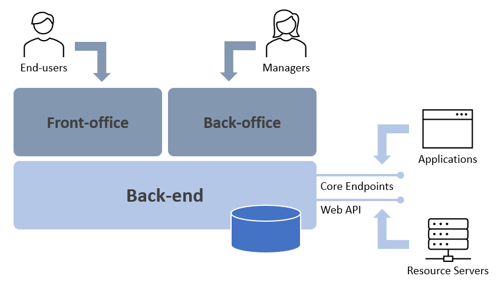

# Vision and Architecture

## Motivations and Objectives

Most user-facing cloud applications need to address two major requirements:

1. How to authenticate users?
2. How to authorize other applications (being them third-party or not) to access its resources?

In a Web-based, RESTfull, world there are 2 frameworks that have become de-facto standards to deal with these requirements, in a way that makes them easier to implement but also in a way that facilitates the integration between different applications and improves the experience of end-users:

- [OAuth 2.0](https://oauth.net/2/)
- [OpenID Connect](https://openid.net/connect/)

PRIMAVERA Identity Server is an Identity and Access Management solution that supports OAuth and OIDC and was designed and is maintained by PRIMAVERA to provide exactly these 2 requirements for all PRIMAVERA's products (cloud and on-premises).

## Authentication & Authorization

**Authentication** refers to the fact that an application needs to validate and know the identity of the user accessing it. Typically, these applications manage data on behalf of that user and need to ensure that the user can only access the resources for which he is allowed.

The most common protocols used for authentication are SAML2p, WS-Federation, and OpenID Connect. OIDC is the newest of the three, but it is also the one with more potential going forward, as it was designed for mobile scenarios and to be API friendly.

**Authorization**, on the other hand, refers to an application having the need to verify that a third-party - another application or even user - can access (and use or manipulate) a designated resource (something owned by an user or an application).

Applications have fundamentally three ways of communicating with APIs: (1) using the application identity; (2) delegating the signed-in user identity; (3) a combination of the previous two.

OAuth 2.0 is a protocol that allows applications to request access tokens from an Authority Server and use them to communicate with APIs.

## Open Standards & Proven Technologies

IDS is built with ASP.NET Core and it implements OAuth 2.0 and OIDC by reusing the middleware provided by Duende Identity Server.

This approach of leveraging open standards like OAuth and OIDC and state-of-the-art technologies like .NET Core, ASP.NET Core, and Duende will ensure its evolution in the coming years, a strong community support and also, not less relevant, its compatibility with the technology stacks used by PRIMAVERA's cloud products.

## Value Proposition

IDS was first conceived to provide authentication and authorization features solely for products manufactured by PRIMAVERA, altough it can (and it may) be used by third-party applications for these purposes in the future.

The implementation is, to some extent, customized and specific to support scenarios required by PRIMAVERA's business model.

From PRIMAVERA's view point, the value proposition is:

- A single, reusable, solution for user authentication and single-sign-on accross all products.
- A single, reusable, solution for API protection and authorization of third-party applications.
- An extensible and customizable IAM implementation, including OAuth 2.0 and OIDC, but also extension points to support additional protocols in the future.
- A managed back-office to configure and operate the system.

From the end-user's perspective:

- A unified single-sign-on and single-sign-out experience accross all PRIMAVERA's products.
- Integration with popular general purpose identity providers like Google, Microsoft, and Apple.

From the view point of third-parties (developers that integrate somehow with PRIMAVERA's APIs):

- Standards-based mechanisms to communicate and perform authorization and authentication.
- A reusable solution for authentication in their own applications.

## High-level Architecture

The following diagram depicts the high level architecture of Identity Server:

Identity Server is a Web application that has 4 main components:

1. The **core endpoints**, which are the endpoints that support the OAuth and OIDC protocols.
2. A **front-office**, which includes the user sign-in experience and a Web site for the user to manage his account.
3. A **back-office**, which is a Web site that allows managers (and contributors) to configure IDS and manage all resources.
4. A **Web API**, that provides access to IDS resources, protected as you would expect by IDS itself.

Resource servers protect their resources using Identity Server. Client applications use Identity Server as Security Token Service to obtain access tokens and/or authenticate users. Both communicate with IDS via the core endpoints and, optionally, the Web API.

> The more details about these components, check out the [Reference](../ref/README.md).